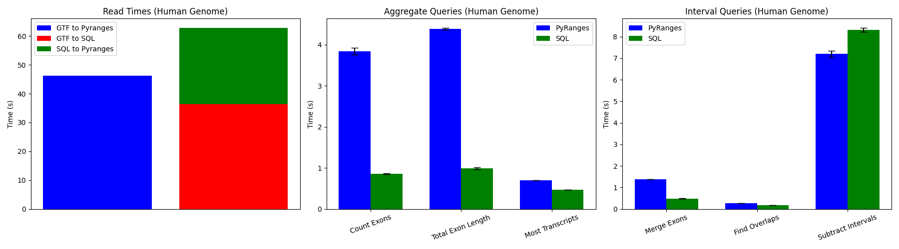
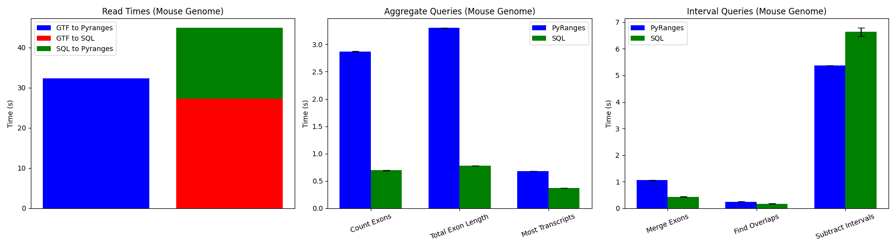
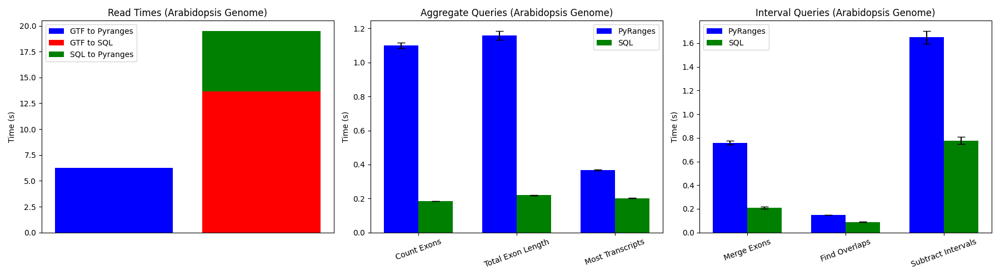

# Add SQLite3 backend for performance Improvement
Hi team,

We (me along with @saketkc) are currently experimenting with using a SQLite3 backend instead of Pandas since it tends to be faster for very large datasets (~GBs of data). It is still at a testing stage but we have implemented the following features:

1. Convert from GTF format to SQLite3 database
2. Convert from GFF3 format to SQLite3 database
3. Convert from SQLite3 database to Pyranges object
4. Perform aggregate queries on genomic interval data: Count exons for each gene, calculate total exon length for each gene, determine the gene with the most transcripts
5. Perform interval queries on genomic interval data: Merge exons, Find overlaps between two datasets, subtract one dataset from another

Here are the results from our tests on a personal laptop and a computing cluster, on the datasets Homo_sapiens.GRCh38.112.chr.gtf, gencode.vM36.annotation.gtf, and Arabidopsis_thaliana.TAIR10.60.gff3:

### PC results

### Cluster results

Overall, we are seeing lower computational times across all aggregate and interval queries, at the cost of slightly more processing time for conversion from GTF/GFF3 to SQLite3 database (though that is also not a major issue since SQLite3 database is persistent on disk, and hence, file processing needs to be done only once and not every time someone wants to re-run their analysis).

Please let us know if this is something worth looking into. Perhaps we can have a discussion on how to properly integrate this into the existing codebase.